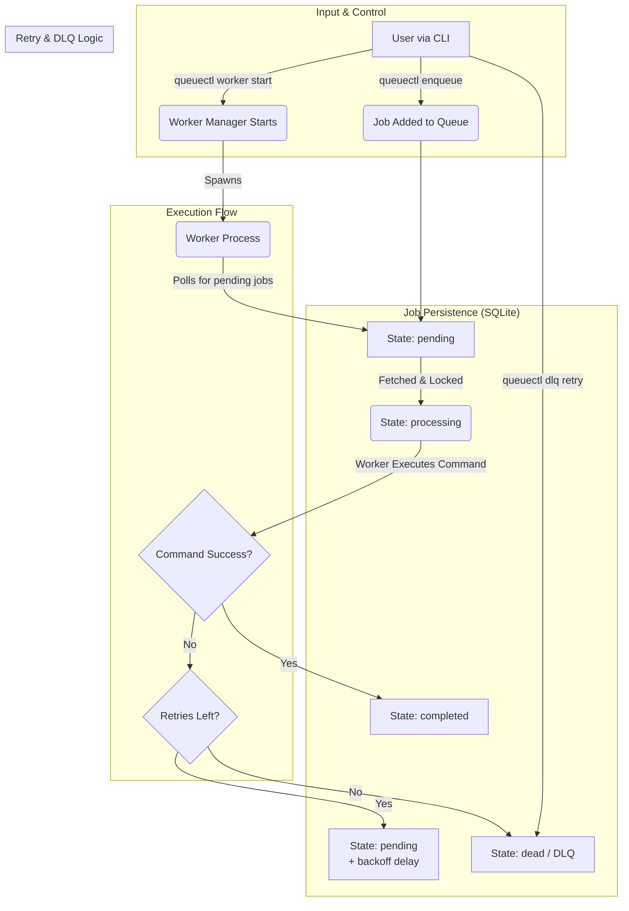

### How It Works:

1.  **Enqueue:** A user enqueues a job, which is stored in the SQLite database with a `pending` state.
2.  **Worker Start:** The user starts the worker manager, which spawns one or more worker processes.
3.  **Processing:** A worker polls the database, atomically locks a `pending` job, and changes its state to `processing`.
4.  **Execution:** The worker executes the job's command.
    *   **On Success:** The job's state is updated to `completed`.
    *   **On Failure:** The system checks if the job has any retries left.
5.  **Retry Logic:**
    *   If retries are available, the job is moved back to the `pending` state, but with an exponential backoff delay before it can be run again.
    *   If all retries are exhausted, the job is moved to the `dead` state (Dead Letter Queue).
6.  **DLQ Management:** A user can manually retry a job from the DLQ, which moves it back to the `pending` state.

```